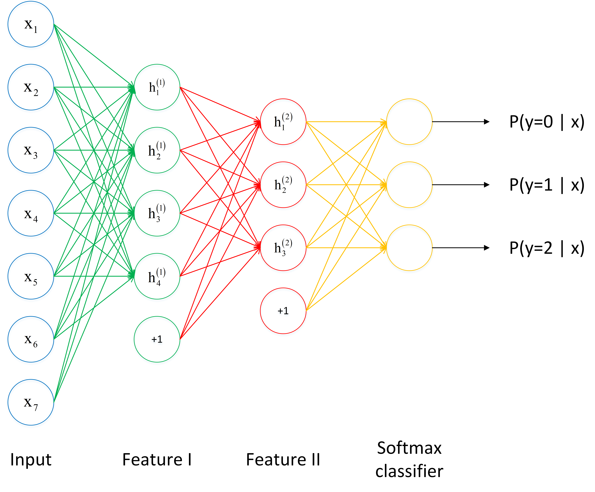
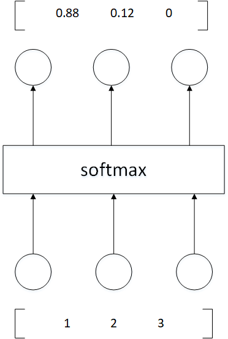

[深度学习]目录
[TOC]

# 深度学习

## 基本介绍
- 深度学习是机器学习的一大分支，它试图使用包含复杂结构或由多重非线性变换构成的多个处理层对数据进行高层抽象的算法
- 深度学习构建在神经网络基础之上，如果想要获得较高的性能体现，需要两个条件：训练一个规模足够大的神经网络，以发挥数据规模量巨大的优点；另外需要更多的数据。规模一直在推动深度学习的进步。
- 算法创新：神经网络方面的一个巨大突破是从sigmoid函数转换到一个ReLU函数（修正线性单元），使得梯度下降算法的算法运行的更快，还有很多...
- 深度学习在不同应用场景的数据量是不一样的，这也就导致我们可能需要考虑分布式计算、多GPU计算的问题。例如，对计算机图像处理研究的人员往往需要将图像文件和计算任务分部到多台计算机节点上进行执行。当下每个深度学习平台都在快速发展，每个平台对分布式计算等场景的支持也在不断演进。

### 为什么使用深层表示?
1. 深度神经网络是一种特征递进式的学习算法，浅层的神经元直接从输入数据中学习一些低层次的简单特征，例如边缘、纹理等。而深层的特征则基于已学习到的浅层特征继续学习更高级的特征，从计算机的角度学习深层的语义信息。
2. 深层的网络隐藏单元数量相对较少，隐藏层数目较多，如果浅层的网络想要达到同样的计算结果则需要指数级增长的单元数量才能达到。

### 为什么神经网络难以训练？
- 层数比较多的神经网络模型在使用梯度下降法对误差进行反向传播时会出现梯度消失和梯度爆炸问题。梯度消失问题和梯度爆炸问题一般会随着网络层数的增加变得越来越明显
    1. 梯度消失(gradient vanishing)
       - 梯度消失是指通过隐藏层从后向前看，梯度会变的越来越小，说明前面层的学习会显著慢于后面层的学习，所以学习会卡住，除非梯度变大。靠近输入层的的权值更新会变得很慢，导致靠近输入层的隐藏层权值几乎不变，仍接近于初始化的权值。这就导致hidden layer 1 相当于只是一个映射层，对所有的输入做了一个函数映射，这时此深度神经网络的学习就等价于只有后几层的隐藏层网络在学习。
       - 梯度消失的原因受到多种因素影响，例如学习率的大小，网络参数的初始化，激活函数的边缘效应等。在深层神经网络中，每一个神经元计算得到的梯度都会传递给前一层，较浅层的神经元接收到的梯度受到之前所有层梯度的影响。如果计算得到的梯度值非常小，随着层数增多，求出的梯度更新信息将会以指数形式衰减，就会发生梯度消失。
        
    2. 梯度爆炸(gradient exploding)
       - 在深度网络或循环神经网络（Recurrent Neural Network, RNN）等网络结构中，梯度可在网络更新的过程中不断累积，变成非常大的梯度，导致网络权重值的大幅更新，使得网络不稳定；在极端情况下，权重值甚至会溢出，变为$NaN$值，再也无法更新。
        

- _权重矩阵的退化导致模型的有效自由度减少（...待补充）_
  参数空间中学习的退化速度减慢，导致减少了模型的有效维数，网络的可用自由度对学习中梯度范数的贡献不均衡，随着相乘矩阵的数量（即网络深度）的增加，矩阵的乘积变得越来越退化。在有硬饱和边界的非线性网络中（例如 ReLU 网络），随着深度增加，退化过程会变得越来越快。Duvenaud等人2014年的论文里展示了关于该退化过程的可视化

### 什么是超参数？

​	**超参数** : 在机器学习的上下文中，超参数是在开始学习过程之前设置值的参数，而不是通过训练得到的参数数据。通常情况下，需要对超参数进行优化，给学习机选择一组最优超参数，以提高学习的性能和效果。

​	超参数通常存在于：

    1.  定义关于模型的更高层次的概念，如复杂性或学习能力。
    2.  不能直接从标准模型培训过程中的数据中学习，需要预先定义。
    3.  可以通过设置不同的值，训练不同的模型和选择更好的测试值来决定

​	超参数具体来讲比如算法中的学习率（learning rate）、梯度下降法迭代的数量（iterations）、隐藏层数目（hidden layers）、隐藏层单元数目、激活函数（ activation function）都需要根据实际情况来设置，这些数字实际上控制了最后的参数和的值，所以它们被称作超参数。

#### 如何寻找超参数的最优值？

​	在使用机器学习算法时，总有一些难调的超参数。例如权重衰减大小，高斯核宽度等等。这些参数需要人为设置，设置的值对结果产生较大影响。常见设置超参数的方法有：

1. 猜测和检查：根据经验或直觉，选择参数，一直迭代。

2. 网格搜索：让计算机尝试在一定范围内均匀分布的一组值（...待补充）

3. 随机搜索：让计算机随机挑选一组值（...待补充）

4. 贝叶斯优化：使用贝叶斯优化超参数，会遇到贝叶斯优化算法本身就需要很多的参数的困难（...待补充）

5. MITIE方法，好初始猜测的前提下进行局部优化。它使用BOBYQA算法，并有一个精心选择的起始点。由于BOBYQA只寻找最近的局部最优解，所以这个方法是否成功很大程度上取决于是否有一个好的起点。在MITIE的情况下，我们知道一个好的起点，但这不是一个普遍的解决方案，因为通常你不会知道好的起点在哪里。从好的方面来说，这种方法非常适合寻找局部最优解。稍后我会再讨论这一点。（...待补充）

6. 最新提出的LIPO的全局优化方法。这个方法没有参数，而且经验证比随机搜索方法好。（...待补充）

#### 超参数搜索一般过程？

超参数搜索一般过程：
1. 将数据集划分成训练集、验证集及测试集。
2. 在训练集上根据模型的性能指标对模型参数进行优化。
3. 在验证集上根据模型的性能指标对模型的超参数进行搜索。
4. 步骤 2 和步骤 3 交替迭代，最终确定模型的参数和超参数，在测试集中验证评价模型的优劣。

其中，搜索过程需要搜索算法，一般有：网格搜索、随机搜过、启发式智能搜索、贝叶斯搜索。

## 激活函数

### 为什么需要非线性激活函数？

**为什么需要激活函数？**

1. 激活函数对模型学习、理解非常复杂和非线性的函数具有重要作用。
2. 激活函数可以引入非线性因素。如果不使用激活函数，则输出信号仅是一个简单的线性函数。线性函数一个一级多项式，线性方程的复杂度有限，从数据中学习复杂函数映射的能力很小。没有激活函数，神经网络将无法学习和模拟其他复杂类型的数据，例如图像、视频、音频、语音等。
3. 激活函数可以把当前特征空间通过一定的线性映射转换到另一个空间，让数据能够更好的被分类。

**为什么激活函数需要非线性函数？**

1. 假若网络中全部是线性部件，那么线性的组合还是线性，与单独一个线性分类器无异。这样就做不到用非线性来逼近任意函数。
2. 使用非线性激活函数 ，以便使网络更加强大，增加它的能力，使它可以学习复杂的事物，复杂的表单数据，以及表示输入输出之间非线性的复杂的任意函数映射。使用非线性激活函数，能够从输入输出之间生成非线性映射。

### 常见的激活函数及图像

1. sigmoid 激活函数

   函数的定义为：$ f(x) = \frac{1}{1 + e^{-x}} $，其值域为 $ (0,1) $。

   函数图像如下：

2. tanh激活函数

   函数的定义为：$ f(x) = tanh(x) = \frac{e^x - e^{-x}}{e^x + e^{-x}} $，值域为 $ (-1,1) $。

   函数图像如下：

3. Relu激活函数

   函数的定义为：$ f(x) = max(0, x) $  ，值域为 $ [0,+∞) $；

   函数图像如下：

4. Leaky Relu 激活函数 

   函数定义为： $ f(x) =  \left\{
   \begin{aligned}
   ax, \quad x<0 \\
   x, \quad x>0
   \end{aligned}
   \right. $，值域为 $ (-∞,+∞) $。 

   图像如下（$ a = 0.5 $）：

5. SoftPlus 激活函数

   函数的定义为：$ f(x) = ln( 1 + e^x) $，值域为 $ (0,+∞) $。

   函数图像如下:

6. softmax 函数

   函数定义为： $ \sigma(z)_j = \frac{e^{z_j}}{\sum_{k=1}^K e^{z_k}} $。

   Softmax 多用于多分类神经网络输出。

### 常见激活函数的导数计算？

对常见激活函数，导数计算如下：

|原函数|函数表达式|导数|备注|
|----|----|-----|-----|
| Sigmoid激活函数 | $f(x)=\frac{1}{1+e^{-x}}$                    | $f^{'}(x)=\frac{1}{1+e^{-x}}\left( 1- \frac{1}{1+e^{-x}} \right)=f(x)(1-f(x))$ | 当$x=10$,或$x=-10​$，$f^{'}(x) \approx0​$,当$x=0​$$f^{'}(x) =0.25​$ |
| Tanh激活函数    | $f(x)=tanh(x)=\frac{e^x-e^{-x}}{e^x+e^{-x}}$ | $f^{'}(x)=-(tanh(x))^2$                                      | 当$x=10$,或$x=-10$，$f^{'}(x) \approx0$,当$x=0$$f^{`}(x) =1$ |
| Relu激活函数    | $f(x)=max(0,x)$                              | $c(u)=\begin{cases} 0,x<0 \\ 1,x>0 \\ undefined,x=0\end{cases}$ | 通常$x=0$时，给定其导数为1和0                                |

### 激活函数有哪些性质？

1. 非线性： 当激活函数是线性的，一个两层的神经网络就可以基本上逼近所有的函数。但如果激活函数是恒等激活函数的时候，即 $ f(x)=x $，就不满足这个性质，而且如果 MLP 使用的是恒等激活函数，那么其实整个网络跟单层神经网络是等价的；
2. 可微性： 当优化方法是基于梯度的时候，就体现了该性质；
3. 单调性： 当激活函数是单调的时候，单层网络能够保证是凸函数；
4. $ f(x)≈x $： 当激活函数满足这个性质的时候，如果参数的初始化是随机的较小值，那么神经网络的训练将会很高效；如果不满足这个性质，那么就需要详细地去设置初始值；
5. 输出值的范围： 当激活函数输出值是有限的时候，基于梯度的优化方法会更加稳定，因为特征的表示受有限权值的影响更显著；当激活函数的输出是无限的时候，模型的训练会更加高效，不过在这种情况小，一般需要更小的 Learning Rate。

### 如何选择激活函数？

- 选择一个适合的激活函数并不容易，需要考虑很多因素，通常的做法是，如果不确定哪一个激活函数效果更好，可以把它们都试试，然后在验证集或者测试集上进行评价。然后看哪一种表现的更好，就去使用它。

以下是常见的选择情况：

1. 如果输出是 0、1 值（二分类问题），则输出层选择 sigmoid 函数，然后其它的所有单元都选择 Relu 函数。
2. 如果在隐藏层上不确定使用哪个激活函数，那么通常会使用 Relu 激活函数。有时，也会使用 tanh 激活函数，但 Relu 的一个优点是：当是负值的时候，导数等于 0。
3. sigmoid 激活函数：除了输出层是一个二分类问题基本不会用它。
4. tanh 激活函数：tanh 是非常优秀的，几乎适合所有场合。
5. ReLu 激活函数：最常用的默认函数，如果不确定用哪个激活函数，就使用 ReLu 或者 Leaky ReLu，再去尝试其他的激活函数。
6. 如果遇到了一些死的神经元，我们可以使用 Leaky ReLU 函数。

### 使用 ReLu 激活函数的优点？

1. 在区间变动很大的情况下，ReLu 激活函数的导数或者激活函数的斜率都会远大于 0，在程序实现就是一个 if-else 语句，而 sigmoid 函数需要进行浮点四则运算，在实践中，使用 ReLu 激活函数神经网络通常会比使用 sigmoid 或者 tanh 激活函数学习的更快。
2. sigmoid 和 tanh 函数的导数在正负饱和区的梯度都会接近于 0，这会造成梯度弥散，而 Relu 和Leaky ReLu 函数大于 0 部分都为常数，不会产生梯度弥散现象。
3. 需注意，Relu 进入负半区的时候，梯度为 0，神经元此时不会训练，产生所谓的稀疏性，而 Leaky ReLu 不会产生这个问题。

### 什么时候可以用线性激活函数？

1. 输出层，大多使用线性激活函数。
2. 在隐含层可能会使用一些线性激活函数。
3. 一般用到的线性激活函数很少。

### 怎样理解 Relu（< 0 时）是非线性激活函数？

Relu 激活函数图像如下：

根据图像可看出具有如下特点：

1. 单侧抑制；

2. 相对宽阔的兴奋边界；

3. 稀疏激活性；

   ReLU 函数从图像上看，是一个分段线性函数，把所有的负值都变为 0，而正值不变，这样就成为单侧抑制。

   因为有了这单侧抑制，才使得神经网络中的神经元也具有了稀疏激活性。

   **稀疏激活性**：从信号方面来看，即神经元同时只对输入信号的少部分选择性响应，大量信号被刻意的屏蔽了，这样可以提高学习的精度，更好更快地提取稀疏特征。当 $ x<0 $ 时，ReLU 硬饱和，而当 $ x>0 $ 时，则不存在饱和问题。ReLU 能够在 $ x>0 $ 时保持梯度不衰减，从而缓解梯度消失问题。

### Softmax 定义及作用

Softmax 是一种形如下式的函数：
$$
P(i) = \frac{exp(\theta_i^T x)}{\sum_{k=1}^{K} exp(\theta_i^T x)}
$$
​其中，$ \theta_i $ 和 $ x $ 是列向量，$ \theta_i^T x $ 可能被换成函数关于 $ x $ 的函数 $ f_i(x) $

​通过 softmax 函数，可以使得 $ P(i) $ 的范围在 $ [0,1] $ 之间。在回归和分类问题中，通常 $ \theta $ 是待求参数，通过寻找使得 $ P(i) $ 最大的 $ \theta_i $ 作为最佳参数。

​但是，使得范围在 $ [0,1] $  之间的方法有很多，为啥要在前面加上以 $ e $ 的幂函数的形式呢？参考 logistic 函数：
$$
P(i) = \frac{1}{1+exp(-\theta_i^T x)}
$$
​
这个函数的作用就是使得 $ P(i) $ 在负无穷到 0 的区间趋向于 0， 在 0 到正无穷的区间趋向 1。同样 softmax 函数加入了 $ e $ 的幂函数正是为了两极化：正样本的结果将趋近于 1，而负样本的结果趋近于 0。这样为多类别提供了方便（可以把 $ P(i) $ 看做是样本属于类别的概率）。可以说，Softmax 函数是 logistic 函数的一种泛化。

​softmax 函数可以把它的输入，通常被称为 logits 或者 logit scores，处理成 0 到 1 之间，并且能够把输出归一化到和为 1。这意味着 softmax 函数与分类的概率分布等价。它是一个网络预测多分类问题的最佳输出激活函数。

### Softmax 函数如何应用于多分类？

​softmax 用于多分类过程中，它将多个神经元的输出，映射到 $ (0,1) $ 区间内，可以看成概率来理解，从而来进行多分类！

​假设我们有一个数组，$ V_i $ 表示 $ V $  中的第 $ i $ 个元素，那么这个元素的 softmax 值就是

$$
S_i = \frac{e^{V_i}}{\sum_j e^{V_j}}
$$

​从下图看，神经网络中包含了输入层，然后通过两个特征层处理，最后通过 softmax 分析器就能得到不同条件下的概率，这里需要分成三个类别，最终会得到 $ y=0, y=1, y=2 $ 的概率值。

继续看下面的图，三个输入通过 softmax 后得到一个数组 $ [0.05 , 0.10 , 0.85] $，这就是 soft 的功能。

更形象的映射过程如下图所示：

​softmax 直白来说就是将原来输出是 $ 3,1,-3 $ 通过 softmax 函数一作用，就映射成为 $ (0,1) $ 的值，而这些值的累和为 $ 1 $（满足概率的性质），那么我们就可以将它理解成概率，在最后选取输出结点的时候，我们就可以选取概率最大（也就是值对应最大的）结点，作为我们的预测目标！

## 深度玻尔兹曼机（DBM）

## 卷积神经网络（CNN）

## 递归神经网络（RNN、LSTM）

## 栈式自编码算法（Stacked Auto-Encoder）